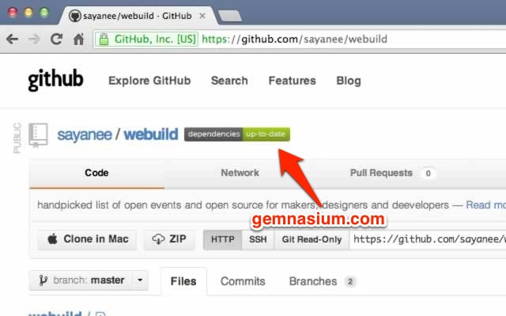

#Github Gemnasium

A [Chrome](https://www.google.com/intl/en/chrome/browser/) extension to see your project dependancies as collated by [Gemnasium](https://gemnasium.com/) beside the project name on [Github](https://github.com/). 

> [Chrome Extension download link](https://chrome.google.com/webstore/detail/github-gemnasium/ofagmhdacmjmedooocoglnhfpfenjfkk)

##Installation

1. Go to [Chrome Web Store](https://chrome.google.com/webstore/detail/github-gemnasium/ofagmhdacmjmedooocoglnhfpfenjfkk)
2. Add to the Chrome browser
3. Visit a Github repository that has connected to [Gemnasium](https://gemnasium.com/)

##Development

1. Increase the `version` according to [Semantic Versioning](http://semver.org/)
1. In the command line run `grunt` to create the `zip` folder
2. Upload the [Chrome Developer Dashboard](https://chrome.google.com/webstore/developer/dashboard) and see the dependancy status

#Credit

This little project is inspired by Github Travis Chrome Extension ([chrome extension](https://chrome.google.com/webstore/detail/github%20travis/klbmicjanlggbmanmpneloekhajhhbfb) and [github repo](https://github.com/wereHamster/github-travis-chrome-extension)). 

